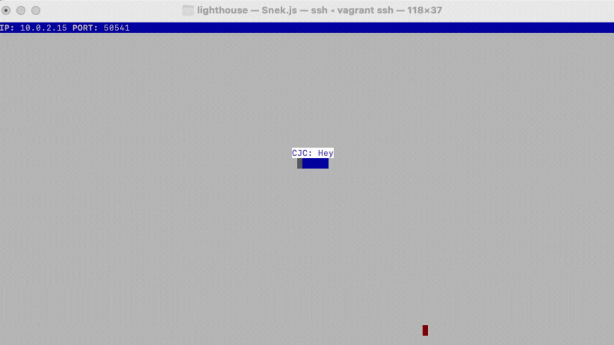

# Snake Client Project

Snake game is a very popular video game. It is a video game concept where the player maneuvers a dot and grows it by ‘eating’ pieces of food. As it moves and eats, it grows and the growing snake becomes an obstacle to smooth maneuvers. The goal is to grow it to become as big as possible without bumping into the side walls, or bumping into itself, upon which it dies.

This is simply a multiplayer take on the genre.

Before you can run this client, you will need to be running the server side which you can download and install from here. 

## Final Product

## Getting Started

- Follow steps inside the snek server repo to run the server side
- Run the development snake client using the `node play.js` command.

## Movement Commands

Your snake will be stationary at the start of the game. Once you give you snake a movement command, it will continue to move forward until you tell it to change direction. You can move your snake with the following keys:

w: move up
a: move left
s: move down
d: move right

## Message Commands

Your snake can speak! /(Sort of!/)

Use the following key commands to make your snake speak:

h: "Hello.."
g: "Goodbye"
i: "I win!"
u: "How are you?"
o: "I am ok!"
1: "100%!!!!"
?: "WHAT???"
*: "hssssss..."

## Game Over

Use control+C to exit the game.
